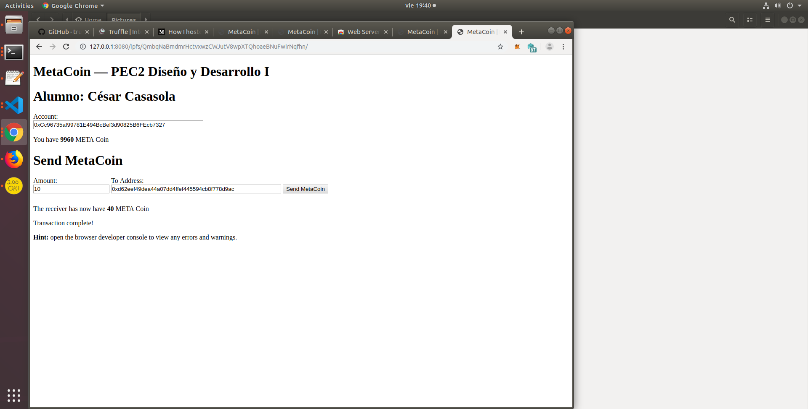

# Ejercicio 2 - IPFS (3 puntos)

A partir de un truffle project como puede ser la pet-shop utilizada en bloques anteriores.
*También puede utilizar otro truffle project.
Haga una pequeña modificación en su frontend para mostrar su nombre al ejecutar la aplicación. (Puede editar cualquier parámetro adicional, siempre y cuando el nombre sea visible).
Suba el truffle project a GitHub manteniendo su estructura. (No incluya la carpeta node_modules).
Arranque un daemon de IPFS y aloje la DApp (Proyecto truffle elegido).
Una vez alojada la DApp, debe ser capaz de utilizar la aplicación al igual que en localhost, es decir, firmando transacciones mediante MetaMask.
Describa todo el procedimiento adjuntando las instrucciones utilizadas y sus outputs, además adjunte el hash de IPFS. Se recomienda realizar la carga (o recarga si ya ha realizado la carga en IPFS) en una fecha cercana a la entrega. Esto es debido a que si
realiza la carga en una fecha temprana, puede que el contenido tarde o no llegue incluso a cargar. También debe indicar si los contratos están desplegados en Ganache o Rinkeby.
*Se recomienda alojar el contenido a subir en IPFS en una única carpeta, ésta también debe alojarse en GitHub.

- Descargo el webpack y realizo una modificación para que aparezca mi nombre

- Cambio el fichero truffle-config.js y le añado el nodo de la red donde voy a trabajar, además de añadir una de las cuentas de ganache previamente desbloqueada

~~~~
rinkeby: {
      host: "localhost", // Connect to geth on the specified
      port: 8545,
      from: "0xcc96735af99781e494bcbef3d90825b6fecb7327", // default address to use for any transaction Truffle makes during migrations
      network_id: 4,
      gas: 4612388 // Gas limit used for deploys
    },
~~~~

- Desprotejo la confiruación de solidity para activar la opción de optimización: 

~~~~ 
compilers: {
    solc: {
        optimizer: {
          enabled: false,
          runs: 200
        },
   }
}
~~~~

~~~~
> truffle develop
truffle Develop started at http://127.0.0.1:8545/

cesar@cesar-VirtualBox:~/master/masteruah-dd1-pec2/ejercicio2/webpack$ truffle develop
Truffle Develop started at http://127.0.0.1:8545/

Accounts:
(0) 0x8098e36215477e34e56aabfc0f77e8987e446745
(1) 0xeaa9a4b6e06c4e2b5da2d14b85fb0f67003f92d0
(2) 0x5b9f95366a9ed6ca90d674d7c226d7efd6940a0d
(3) 0x437663386caab0a775c450ef25a22e02fda2462f
(4) 0x23185864f266eccad720376f5fbe8f5ca18e6bb5
(5) 0x700e9ed9ffdfe014f91c25032fa0fe4d46904188
(6) 0x951be35b4495365b3fdcb17427e0c0488a88b98f
(7) 0x9818c79066e7759a57bb42c8f700cd5de2721020
(8) 0x01fe4fc447629b546bac81c91cd3906d709365cd
(9) 0x72a3c39b3b611cb888128257881ae1610e2e6c14

Private Keys:
(0) ca2dbb44ad1df7bcccadf5bf646876c64f4fe01c3a815aceac67cec2c847af87
(1) adc2bb5a884468a79797a935625549a91a4ddbfe6bdf8479da979451fc62efd0
(2) 30576f23af304d97020bb278b14830558229b47703b0f9d06b1dcc0b0ad788eb
(3) e38147b6086c8492a77433b6d8d6972d019994aabd5881d370ff130d98619b80
(4) a562e78132acfa7b4142c10ed564ec2c91faa1418ac20fe0c3f79a54488c5438
(5) a9ae9dbd5326135e21fe195aac1063f4d76a5d989bf1499f610154d238ca22e9
(6) 3f9db7c75ab790b284b80950ba816d2be741e5e23a969cd1ba70d536e15f9f05
(7) ba1dab279970e461f657cbed1a4d90720eb6da3b357ad50e43b54df4211b86ff
(8) b78962f912ca03fe98749de2d1d751ea224c2981f4e81c9c23776a5b42029ccb
(9) 03894cfb88784f33698b80246d41ce3756b051673f494e14f03a115ed6feece3

Mnemonic: stereo shove acquire message jump stumble trick orange chimney mixture seat fabric

⚠️  Important ⚠️  : This mnemonic was created for you by Truffle. It is not secure.
Ensure you do not use it on production blockchains, or else you risk losing funds.
~~~~

- Se lleva a cabo la compilación compila
~~~~
> truffle compile
~~~~

- Desbloqueamos la cuenta que vamos a utilizar 
~~~~
> personal.unlockAccount("0xcc96735af99781e494bcbef3d90825b6fecb7327")
Unlock account 0xcc96735af99781e494bcbef3d90825b6fecb7327
Passphrase: 
true
> 
~~~~

- Migramos el proyecto
~~~~
> truffle migrate network --rinkeby
> Block gas limit: 0x6aea72

1_initial_migration.js
======================

   Deploying 'Migrations'
   ----------------------
   > block number:        4681171
   > block timestamp:     1562347358
   > account:             0xCc96735af99781E494BcBef3d90825B6FEcb7327
   > balance:             0.199507214
   > gas used:            246393
   > gas price:           2 gwei
   > value sent:          0 ETH
   > total cost:          0.000492786 ETH

   -------------------------------------
   > Total cost:         0.000492786 ETH

2_deploy_contracts.js
=====================

   Deploying 'ConvertLib'
   ----------------------
   > block number:        4681173
   > block timestamp:     1562347359
   > account:             0xCc96735af99781E494BcBef3d90825B6FEcb7327
   > balance:             0.19924605
   > gas used:            103559
   > gas price:           2 gwei
   > value sent:          0 ETH
   > total cost:          0.000207118 ETH

   Linking
   -------
   * Contract: MetaCoin <--> Library: ConvertLib 

   Deploying 'MetaCoin'
   --------------------
   > block number:        4681174
   > block timestamp:     1562347359
   > account:             0xCc96735af99781E494BcBef3d90825B6FEcb7327
   > balance:             0.198599352
   > gas used:            323349
   > gas price:           2 gwei
   > value sent:          0 ETH
   > total cost:          0.000646698 ETH

   -------------------------------------
   > Total cost:         0.000853816 ETH

Summary
=======
> Total deployments:   3
> Final cost:          0.001346602 ETH

Starting migrations...
======================
> Network name:    'rinkeby'
> Network id:      4
> Block gas limit: 0x6aea72

1_initial_migration.js
======================

   Deploying 'Migrations'
   ----------------------
   > transaction hash:    0x6ab6854b61817d215015c6ac594b7c27ea5281c750f943cfaa0590b659ced914
   > Blocks: 1            Seconds: 24
   > contract address:    0xE558B21bd954C6EB47Ee4759e69da8b9C3a17589
   > block number:        4681171
   > block timestamp:     1562347384
   > account:             0xCc96735af99781E494BcBef3d90825B6FEcb7327
   > balance:             0.19477214
   > gas used:            261393
   > gas price:           20 gwei
   > value sent:          0 ETH
   > total cost:          0.00522786 ETH

   > Saving migration to chain.
   > Saving artifacts
   -------------------------------------
   > Total cost:          0.00522786 ETH

2_deploy_contracts.js
=====================

   Deploying 'ConvertLib'
   ----------------------
   > transaction hash:    0xaa6edbb2ea1165dae9f650e621639a6dd3d9c8db31978567af9bf0c79344a5c0
   > Blocks: 0            Seconds: 12
   > contract address:    0x0E269474E07D7C39468d6c5cF89ecB5c0BD67319
   > block number:        4681173
   > block timestamp:     1562347414
   > account:             0xCc96735af99781E494BcBef3d90825B6FEcb7327
   > balance:             0.1918605
   > gas used:            103559
   > gas price:           20 gwei
   > value sent:          0 ETH
   > total cost:          0.00207118 ETH

   Linking
   -------
   * Contract: MetaCoin <--> Library: ConvertLib (at address: 0x0E269474E07D7C39468d6c5cF89ecB5c0BD67319)

   Deploying 'MetaCoin'
   --------------------
   > transaction hash:    0x49faa3053b64d123ddd14145afcf673d006052448ab7daccb71f76572af286a9
   > Blocks: 0            Seconds: 12
   > contract address:    0x0bf1143bF3979eD0E6c0eF453227d6D2DC1100b3
   > block number:        4681174
   > block timestamp:     1562347429
   > account:             0xCc96735af99781E494BcBef3d90825B6FEcb7327
   > balance:             0.18509352
   > gas used:            338349
   > gas price:           20 gwei
   > value sent:          0 ETH
   > total cost:          0.00676698 ETH

   > Saving migration to chain.
   > Saving artifacts
   -------------------------------------
   > Total cost:          0.00883816 ETH

Summary
=======
> Total deployments:   3
> Final cost:          0.01406602 ETH

~~~~

- Contruimos la aplicación web
~~~~
> cd app
> npm install
> npm run build
~~~~

Para visualizar la aplicación he utilizado el chrome server: http://127.0.0.1:8887, configurando la carpeta dist como carpeta app/dist

>Cuentas utilizadas en la prueba:["0xCc96735af99781E494BcBef3d90825B6FEcb7327", "0xd62eef49dea44a07dd4ffef445594cb8f778d9ac"]

En Etherscan se puede comprobar las trnasacciones realizadas:

## IPFS
----

- Instalación de IPFS:
~~~~
sudo apt-get update
sudo apt-get install golang-go -y
wget https://dist.ipfs.io/go-ipfs/v0.4.10/go-ipfs_v0.4.10_linux-386.tar.gz
tar xvfz go-ipfs_v0.4.10_linux-386.tar.gz
sudo mv go-ipfs/ipfs /usr/local/bin/ipfs
~~~~

- Inicio del nodo de IPFS
~~~~
cesar@cesar-VirtualBox:~/master/go-ipfs$ ipfs init
initializing IPFS node at /home/cesar/.ipfs
generating 2048-bit RSA keypair...done
peer identity: QmVmC532VT24KgaU5rbeK5V1bN7W8qBh9F2SUdF5hUVqz4
to get started, enter:

        ipfs cat /ipfs/QmVLDAhCY3X9P2uRudKAryuQFPM5zqA3Yij1dY8FpGbL7T/readme
~~~~

- Subimos la carpeta a IPFS
~~~~
cesar@cesar-VirtualBox:~/master/masteruah-dd1-pec2$ ipfs add -r ejercicio2/webpack/app/dist/
added QmWVCaDea4NR5UbsLFzvrZfkGkgYgyGop5JmR81ypTX5kf dist/index.html
added QmVLjBJSauepY1vTQjgm33xfb81yF4PrJkCzhZ5pDidTb4 dist/index.js
added QmbqNaBmdmrHctvxwzCWJutV8wpXTQhoaeBNuFwirNqfhn dist
cesar@cesar-VirtualBox:~/master$ 
~~~~

- Activo el nodo de IPFS:
~~~~
cesar@cesar-VirtualBox:~/master$ ipfs daemon
Initializing daemon...
Adjusting current ulimit to 2048...
Successfully raised file descriptor limit to 2048.
~~~~

- Y abro la aplicación desde la ruta:
~~~~
http://127.0.0.1:8080/ipfs/QmbqNaBmdmrHctvxwzCWJutV8wpXTQhoaeBNuFwirNqfhn/
~~~~

