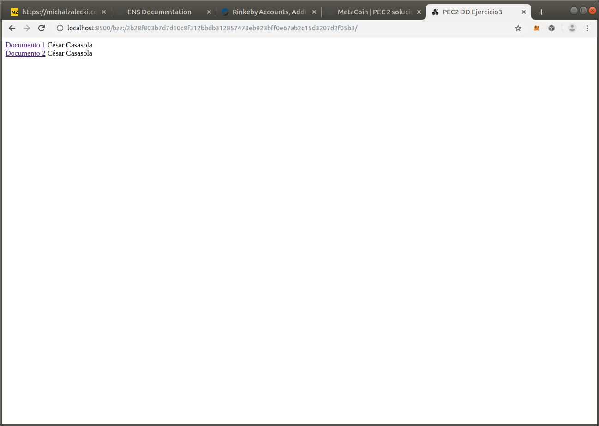

# Ejercicio 3 - SWARM (2 puntos)
Cree una página web básica (archivo HTML) en la cual se muestren los vínculos a dos archivos distintos alojados en Swarm además de su nombre.
En la subida de los archivos debe utilizar el cifrado disponible en Swarm.
No se considerará válido si se suben los contenidos por separado y se vinculan en el archivo HTML posteriormente. Al navegar entre los archivos, el hash de Swarm mostrado en la barra de direcciones no debe cambiar.
No es necesario vincular el hash de Swarm a ENS.

["0x148157cef85ffa1f0bac483c2a75e0f3baff0278", "0xd62eef49dea44a07dd4ffef445594cb8f778d9ac"]

Metamask Rinkeby: 0xCc96735af99781E494BcBef3d90825B6FEcb7327

personal.newAccount()
web3.fromWei(eth.getBalance("0x148157cef85ffa1f0bac483c2a75e0f3baff0278"));
web3.fromWei(eth.getBalance("0xd62eef49dea44a07dd4ffef445594cb8f778d9ac")); 

- Creamos una cuenta para utilizar en sawrm
~~~~
geth account new
INFO [07-03|19:35:45.621] Maximum peer count                       ETH=25 LES=0 total=25
Your new account is locked with a password. Please give a password. Do not forget this password.
Passphrase: master
Repeat passphrase: master 
Address: {fb9284eb67d8679b45670cf452e97b3c46a64216}
~~~~

- Instalación de Swarm -----
~~~~
sudo apt-get install software-properties-common
sudo add-apt-repository -y ppa:ethereum/ethereum
sudo apt-get update
sudo apt-get install ethereum-swarm
~~~~

- Para iniciar sawrm con la cuenta fb9284eb67d8679b45670cf452e97b3c46a64216
~~~~
swarm --bzzaccount fb9284eb67d8679b45670cf452e97b3c46a64216
~~~~

- Comprobamos que el nodo se ha levantado
~~~~
http://localhost:8500
~~~~

> Documentos utilizados en la práctica: documento1.txt, documento2.txt

### Sin Encriptar
~~~~
swarm --defaultpath basic_web/index.html --recursive up basic_web

cesar@cesar-VirtualBox:~/master/masteruah-dd1-pec2/ejercicio3$ swarm --defaultpath basic_web/index.html --recursive up basic_web
2b28f803b7d7d10c8f312bbdb312857478eb923bff0e67ab2c15d3207d2f05b3
cesar@cesar-VirtualBox:~/master/masteruah-dd1-pec2/ejercicio3$
~~~~

- Se visualiza con la ruta
http://localhost:8500/bzz:/2b28f803b7d7d10c8f312bbdb312857478eb923bff0e67ab2c15d3207d2f05b3/

### Encriptado
~~~~
> swarm --defaultpath basic_web/index.html --recursive up --encrypt basic_web

cesar@cesar-VirtualBox:~/master/masteruah-dd1-pec2/ejercicio3$ swarm --defaultpath basic_web/index.html --recursive up --encrypt basic_web
c99a0618d9932b9b33832e2b35e97b296b615a4a5edb4a64e4f6ccd0a7033bf9afdffd01e16ca80bdcba9e4d69368d7d8bace98b6191053bcbe15bb81d3c8d4f
~~~~

http://:master@localhost:8500/bzz:/c99a0618d9932b9b33832e2b35e97b296b615a4a5edb4a64e4f6ccd0a7033bf9afdffd01e16ca80bdcba9e4d69368d7d8bace98b6191053bcbe15bb81d3c8d4f

