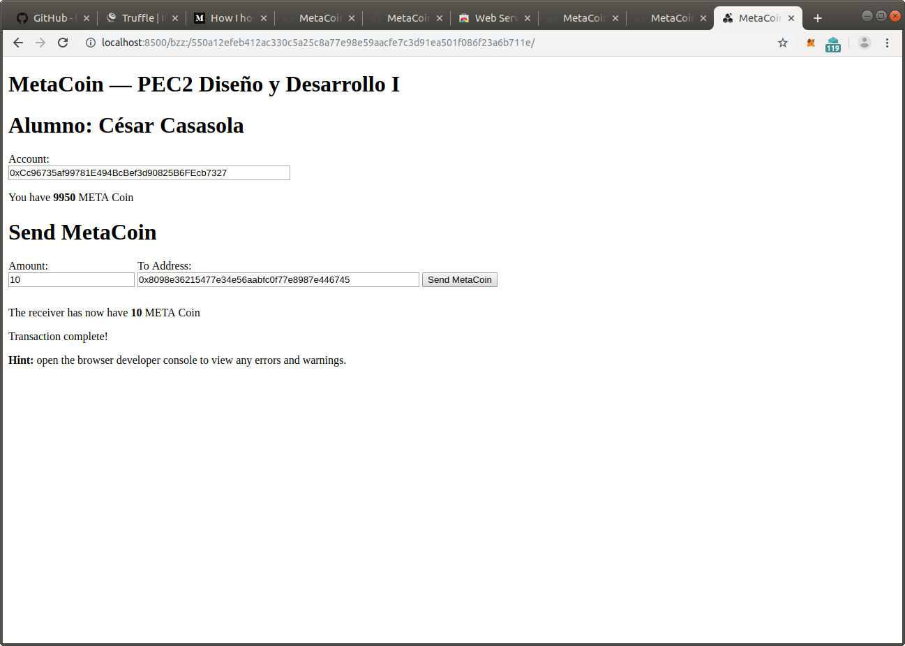

# Ejercicio 4 - SWARM (4 puntos)
Puede reutilizar parte de lo que ha realizado en el ejercicio 2 (hasta subir el proyecto a GitHub).
Arranque un nodo de Swarm y aloje la DApp (Proyecto truffle elegido).
Además, vincule el ENS adquirido en el ejercicio 1 con la DApp, de tal forma que una url como la de a continuación muestre la aplicación. Por ejemplo: http://localhost:8500/bzz:/swarmtest.test/index.html
Una vez alojada la DApp, debe ser capaz de utilizar la aplicación al igual que en localhost, es decir, firmando transacciones mediante MetaMask.

- Para iniciar sawrm con una la cuenta fb9284eb67d8679b45670cf452e97b3c46a64216
~~~~ 
swarm --bzzaccount fb9284eb67d8679b45670cf452e97b3c46a64216 --ens-api 0xe7410170f87102df0055eb195163a03b7f2bff4a@/home/cesar/.ethereum/rinkeby/geth.ipc
~~~~

- Se activa swarm
~~~~
swarm --defaultpath webpack/app/dist/index.html --recursive up webpack/app/dist

cesar@cesar-VirtualBox:~/master/masteruah-dd1-pec2/ejercicio4$ swarm --defaultpath webpack/app/dist/index.html --recursive up webpack/app/dist
550a12efeb412ac330c5a25c8a77e98e59aacfe7c3d91ea501f086f23a6b711e
~~~~

- Se puede comprobar la aplicación en swarm
http://localhost:8500/bzz:/550a12efeb412ac330c5a25c8a77e98e59aacfe7c3d91ea501f086f23a6b711e/

>Para probarlo se han utilziado en la web las cuentas 0x8098e36215477e34e56aabfc0f77e8987e446745, 0xcc96735af99781e494bcbef3d90825b6fecb7327

## ENS
- Se carga la librería de utilidades de ens
~~~~
> loadScript("./ensutils-rinkeby.js")
true
> 
~~~~

- Se resuelve el nombre de cesarcasasola sobre el contenido representado por el hash de swarm:
~~~~
> publicResolver.setContent(namehash('cesarcasasola.test'), '550a12efeb412ac330c5a25c8a77e98e59aacfe7c3d91ea501f086f23a6b711e', {from: eth.accounts[0]})
"0x43c5a984ddace83b1fafe45c127f8a8155340c991658ce5ecfb2d8fe306789a0"
~~~~

- Se visualiza el contenido
>http://localhost:8500/bzz:/cesarcasasola.test

